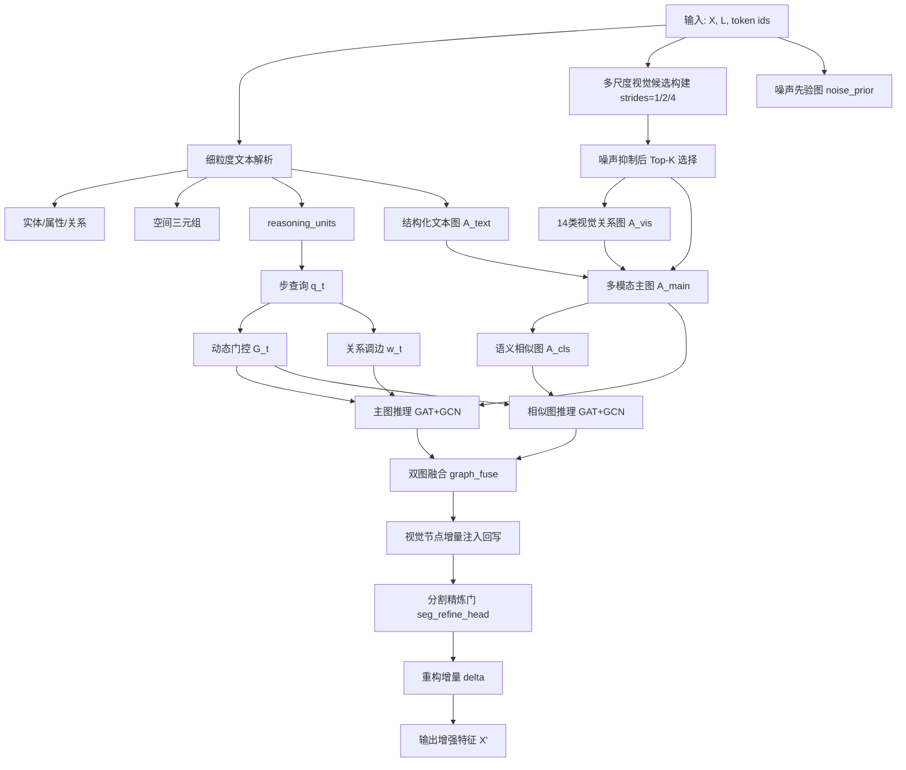

# 面向复杂嵌套文本的多尺度双图动态推理模块（论文风格版）

## 摘要

针对遥感指代分割（Remote Sensing Referring Expression Segmentation, RSE）中复杂嵌套文本带来的语义错配问题，本文提出一种多尺度双图动态推理模块。方法以细粒度文本结构解析为起点，联合结构化文本图、多尺度视觉图与语义相似图进行逐步推理，并通过文本关系调边与噪声先验抑制提升鲁棒性。相较粗粒度融合策略，该方法在复杂多实体、多关系表达中可显著增强语义对齐与目标定位稳定性。

---

## 1. 问题定义与符号

给定图像特征图 $\mathbf{X}\in\mathbb{R}^{B\times C\times H\times W}$ 与文本特征 $\mathbf{L}\in\mathbb{R}^{B\times D_t\times N}$，目标是学习增强映射

$$
\mathcal{F}: (\mathbf{X},\mathbf{L},\mathbf{M}_l) \mapsto \mathbf{X}'
$$

其中 $\mathbf{M}_l$ 为文本掩码，$\mathbf{X}'$ 输入分割头得到最终掩码预测。

符号约定：

- $B$：batch size
- $D$：图推理隐空间维度（hidden\_dim）
- $K$：采样视觉节点数
- $M$：文本节点数
- $N$：文本 token 数
- $R$：视觉关系类型数（本方法中 $R=14$）

---

## 2. 方法总览

### 2.1 端到端流程图

### 2.2 核心思想

- 结构化语义：文本从“整体向量”提升为“目标-参考-属性-关系”节点图。
- 多尺度视觉：通过多尺度候选覆盖小中大地物，缓解遥感尺度差异。
- 关系显式建模：视觉边扩展为 14 类（方位+拓扑+尺度）。
- 文本驱动调边：关系词语义直接调制视觉边权。
- 动态去噪：节点门控 + 噪声先验双机制抑制背景干扰。

### 2.3 技术路线（分阶段实现）

为便于工程实现与论文叙述对齐，整体技术路线可划分为六个阶段：

1. 输入编码阶段：由视觉主干提取多层特征，由文本编码器输出 token 级语义特征与掩码。
2. 结构解析阶段：对文本进行实体、属性、关系、空间三元组与推理单元解析，形成结构化中间表示。
3. 图构建阶段：基于多尺度候选视觉节点构建 14 类关系视觉图，同时构建文本结构图，并组装多模态主图与语义相似图。
4. 动态推理阶段：以子表达式查询为驱动，执行节点门控、边门控与关系调边，随后在主图和相似图并行进行 GAT+GCN 消息传递。
5. 融合回写阶段：将双图推理结果经门控融合后，采用增量注入策略回写到密集视觉特征图。
6. 分割优化阶段：通过分割精炼门调制重构增量，输出增强特征并送入分割头完成预测。

对应的信息流可写为：

$$
	ext{Text/Visual Encode} \rightarrow \text{Structured Parse} \rightarrow \text{Dual-Graph Build}
\rightarrow \text{Dynamic Reasoning} \rightarrow \text{Fusion \& Write-back} \rightarrow \text{Segmentation}
$$

该路线的关键在于“结构化先验 + 动态图推理 + 分割回写”三者闭环：解析结果约束图结构，图推理增强视觉语义，增强特征再反馈到像素级分割目标。

---

## 3. 细粒度文本结构解析

解析器输出：

- 目标实体 $e^*$
- 参考实体集合 $\mathcal{E}_r$
- 属性集合 $\mathcal{A}$
- 关系集合 $\mathcal{R}$（含关系类型）
- 空间三元组集合 $\mathcal{T}=\{(e_i,r_{ij},e_j)\}$
- 子表达式推理单元 $\mathcal{U}=\{(s_t,e_t)\}_{t=1}^{T}$

子表达式区间采用渐进式构建：

$$
\mathcal{U} = \{(s_1,e_1),\dots,(s_T,e_T)\},\quad T\approx \#\text{entities}
$$

$$
[s_t,e_t] \leftarrow \bigcup_{i=1}^{t}[\hat{s}_i,\hat{e}_i]
$$

该策略使第 $t$ 步查询聚焦于“当前层级累计语义”。

---

## 4. 图结构建模

### 4.1 文本结构图

文本节点集合 $\mathcal{V}_T$ 包含目标、参考、属性、关系节点。文本邻接矩阵 $\mathbf{A}_T\in\mathbb{R}^{M\times M}$ 规则如下：

1. 自环：$A_{ii}=1$
2. 目标-参考连边
3. 实体-属性连边
4. 三元组链：$e_i\leftrightarrow r_{ij}\leftrightarrow e_j$
5. 弱连接先验：$\mathbf{A}_T\leftarrow\max(\mathbf{A}_T,\epsilon)$，$\epsilon=0.05$

### 4.2 多尺度视觉图

先构建多尺度候选节点（strides $\in\{1,2,4\}$），再进行目标引导 Top-$K$ 选择。视觉关系边扩展为 $R=14$ 类：

- 8 类方位：east/south/west/north/se/sw/ne/nw
- 3 类拓扑：contain/inside/adjacent
- 3 类尺度：larger/smaller/similar

关系边权由目标语义与关系文本联合生成：

$$
\mathbf{w}=\operatorname{softmax}(W_r\mathbf{h}_{e^*}+W_t\mathbf{h}_{rel})\in\mathbb{R}^{14}
$$

$$
\mathbf{A}_V = \sum_{m=1}^{14} w_m\mathbf{A}^{(m)} + \mathbf{I}
$$

其中 $\mathbf{h}_{rel}$ 为关系词摘要特征。

### 4.3 多模态主图与相似图

拼接节点特征：

$$
\mathbf{H}_0=[\mathbf{H}_V;\mathbf{H}_T]\in\mathbb{R}^{(K+M)\times D}
$$

主图邻接：

$$
\mathbf{A}_{\text{main}}=
\begin{bmatrix}
\mathbf{A}_V & \mathbf{A}_{VT}\\
\mathbf{A}_{TV} & \mathbf{A}_T
\end{bmatrix},
\quad
\mathbf{A}_{VT}=\sigma\left(\frac{\mathbf{H}_V\mathbf{H}_T^\top}{\sqrt{D}}\right)
$$

相似图邻接：

$$
\mathbf{A}_{\text{cls}}=0.15\cdot\left(\frac{\hat{\mathbf{H}}_0\hat{\mathbf{H}}_0^\top+1}{2}\right)+\mathbf{I}
$$

---

## 5. 动态门控与文本关系调边

第 $t$ 步子表达式查询：

$$
\mathbf{q}_t=\operatorname{MeanPool}(\mathbf{L}_{s_t:e_t})
$$

节点相关性：

$$
\mathbf{s}_t = \sigma\left(\frac{\langle \mathbf{H}_{t-1},\mathbf{q}_t\rangle}{\sqrt{D}}\right)
$$

节点门控：

$$
\mathbf{g}_t = 0.1 + 0.9\cdot\left(\mathbb{I}[\mathbf{s}_t > \tau\bar{s}_t]\odot\mathbf{s}_t\right),\quad \tau=0.85
$$

边门控：

$$
\mathbf{G}_t = \mathbf{g}_t\mathbf{g}_t^\top
$$

动态邻接：

$$
\mathbf{A}^{(t)}_{\text{main}}=\mathbf{A}_{\text{main}}\odot\mathbf{G}_t,
\quad
\mathbf{A}^{(t)}_{\text{cls}}=\mathbf{A}_{\text{cls}}\odot\mathbf{G}_t
$$

关系调边更新：

$$
\mathbf{w}^{(t)} = \mathbf{w}^{(0)} + \alpha_e\,\psi(\mathbf{q}_t)
$$

$$
\mathbf{A}_{V}^{(t)} = \sum_{m=1}^{14} w_m^{(t)}\mathbf{A}^{(m)} + \mathbf{I}
$$

其中 $\alpha_e$ 为可学习步进系数（edge\_update\_alpha）。

---

## 6. 双图并行推理与融合

每步在两图执行 GAT+GCN：

$$
\mathbf{H}^{m}_t=\operatorname{GCN}(\operatorname{GAT}(\mathbf{H}_{t-1},\mathbf{A}^{(t)}_{\text{main}}),\mathbf{A}^{(t)}_{\text{main}})
$$

$$
\mathbf{H}^{c}_t=\operatorname{GCN}(\operatorname{GAT}(\mathbf{H}_{t-1},\mathbf{A}^{(t)}_{\text{cls}}),\mathbf{A}^{(t)}_{\text{cls}})
$$

融合门：

$$
\boldsymbol{\gamma}_t=\sigma(\operatorname{MLP}([\mathbf{H}^{m}_t;\mathbf{H}^{c}_t]))
$$

融合特征：

$$
\mathbf{H}_t=\boldsymbol{\gamma}_t\odot\mathbf{H}^{m}_t+(1-\boldsymbol{\gamma}_t)\odot\mathbf{H}^{c}_t
$$

步数自适应：

$$
T = \min(T_{\max}, |\mathcal{U}|)
$$

---

## 7. 分割任务适配精炼

视觉节点推理后采用“增量注入回写”到密集特征图 $\mathbf{F}_r$（非直接覆盖 scatter）。

分割精炼门：

$$
\mathbf{M}_s=\operatorname{SegRefineHead}(\mathbf{F}_r)\in[0,1]^{B\times1\times H\times W}
$$

重构增量：

$$
\Delta=\operatorname{Reconstruct}(\mathbf{F}_r)
$$

门控增强：

$$
\Delta' = \Delta\odot(1+\tanh(\alpha_r)\cdot\mathbf{M}_s)
$$

输出：

$$
\mathbf{X}'=\mathbf{X}+\tanh(\alpha)\cdot\Delta'
$$

---

## 8. 方法优势

1. 多尺度节点覆盖遥感目标尺度跨度（小目标到大区域）。
2. 14 类视觉关系边提升空间与尺度关系表达力。
3. 文本关系调边增强“关系词 -> 边权”可解释映射。
4. 动态门控 + 噪声先验双重去噪，提升复杂背景稳健性。
5. 双图融合兼顾结构约束与语义相似性。
6. 直接服务分割主干，无需引入检测框回归分支。

---

## 9. 训练与复现建议

1. 训练策略

- 先 warm-up 图推理分支 3-5 epoch
- 再进行联合训练
- 初始学习率适当偏小，避免早期边更新震荡

2. 建议消融

- w/o structured text edges
- w/o 14-relation visual graph
- w/o relation-text edge modulation
- w/o multi-scale candidates
- w/o noise prior suppression
- w/o dynamic gating
- w/o dual-graph fusion
- w/o segmentation refine gate

3. 指标建议

- 主指标：mIoU / overall IoU
- 复杂文本分桶：按实体数、关系数、嵌套深度
- 效率指标：每 iter 延迟 / FPS

---

## 10. 局限性与未来工作

1. 文本分解仍以启发式规则为主，缺少可学习分解监督。
2. 批内前向仍按样本循环，存在并行化空间。
3. 门控阈值固定，尚未学习化。
4. 相似图当前基于特征相似，缺少显式类别先验。
5. 地理特征当前主要由图像坐标/尺度近似，尚未引入真实经纬度、面积等元数据。

未来可进一步引入：分解一致性损失、门控稀疏正则、类别先验图与跨图对齐损失。

---

## 11. 论文方法章节可复用段落

我们提出一种面向复杂嵌套指代表达的多尺度双图动态推理模块。文本端首先解析实体、属性、关系、空间三元组及子表达式推理单元；视觉端通过多尺度候选构建并结合噪声先验筛选关键节点。随后，模型构建结构化文本图与 14 类关系视觉图，并组装为多模态主图，同时构建语义相似图作为互补分支。在每个推理步，模型利用子表达式查询执行节点-边动态门控，并以关系文本特征对视觉边权进行步进调制。双图并行消息传递后，通过可学习融合门得到统一节点表示，最后以节点增量注入方式回写密集特征图，并经分割精炼门调制输出增强特征。该方法在复杂多实体、多关系遥感文本场景下显著提升语义对齐与噪声抑制能力。

---

## 12. 技术路线优势与不足分析

### 12.1 优势

1. 语义对齐能力强：通过实体-关系-属性显式建图，能较好处理“目标 + 参照物 + 空间关系”的嵌套表达。
2. 复杂场景鲁棒性高：多尺度候选与噪声先验联合抑制背景干扰，对遥感大场景中的小目标更友好。
3. 可解释性较好：14 类视觉关系边与关系词调边机制提供了可追踪的“文本词汇到图边权重”映射。
4. 推理路径清晰：子表达式驱动的逐步更新使模型具备一定“分步推理”特性，便于误差定位与可视化分析。
5. 任务适配直接：图推理结果以增量方式注入分割特征，避免额外检测分支，和现有分割框架耦合成本较低。

### 12.2 不足

1. 计算与显存开销偏高：多尺度采样、双图并行与多步推理会带来额外时延，训练和推理成本高于单路融合模型。
2. 解析误差会级联：若文本结构解析错误，可能在图构建与动态调边阶段被放大，影响最终分割结果。
3. 超参数较多：如节点数 $K$、步数 $T$、门控阈值、关系边权更新系数等，跨数据集迁移时调参负担较重。
4. 关系集合仍有限：固定 14 类关系对长尾关系和隐式语义覆盖不足，泛化到开放词汇关系时可能受限。
5. 实现复杂度较高：模块链路长、调试面广，对工程维护、复现实验与消融控制提出更高要求。

### 12.3 改进方向

1. 轻量化：采用稀疏注意力或动态图剪枝降低双图推理成本。
2. 可学习解析：将启发式文本解析替换为可训练结构预测器，减少规则依赖。
3. 自适应关系集：从固定关系类别扩展为可组合关系原型，提升开放场景泛化。
4. 稳定训练：为门控与调边引入一致性正则和温度退火，缓解早期训练震荡。
5. 融合外部先验：结合类别知识图谱或地理元数据，增强跨区域和跨传感器鲁棒性。
