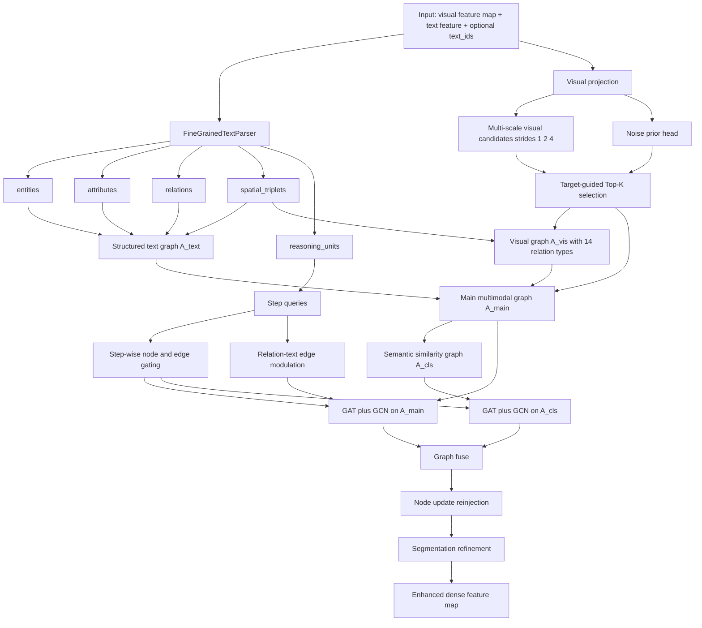
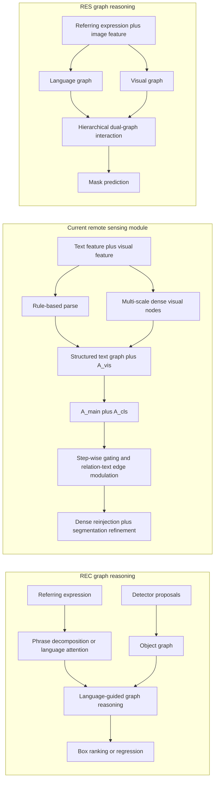

# 遥感指代分割图推理模块对比分析报告

## 0. 报告定位与分析边界

本报告面向当前项目中的复杂文本解析与图推理模块，分析对象以 `lib/graph_reasoning_chain_v2.py` 为主，结合 `lib/backbone.py`、`lib/rs_vocabulary.py`、`COMPLEX_TEXT_PARSER_DETAILED_GUIDE.md` 与 `PAPER_STYLE_METHOD_GRL.md` 进行结构梳理与方法对比。

本报告有两个边界需要先说明：

1. 当前项目中的“复杂文本解析模块”不是一个独立的纯文本解析器，而是一个由“规则文本解析 + 图构建 + 双图推理 + 分割回写”组成的联合模块。
2. 截至 `2026-03-25`，REC/RES 总体主流已经大幅转向 Transformer、VLM、SAM-style 融合范式，但图推理仍然是“显式结构建模”分支中的重要路线。本报告比较的是这一分支中的代表性与近年方法，而不是全领域所有最新 SOTA。

为避免混淆，报告中将明确区分两类结论：

- `代码事实`：可以直接从当前仓库代码或现有文档中核对到的实现事实。
- `分析推断`：基于代码结构与代表性图推理论文之间的比较所得出的研究判断。

---

## 1. 当前模块的结构定位

### 1.1 一句话概括

当前模块本质上是一个面向遥感指代分割的“结构化文本解析驱动的多尺度双图动态推理模块”，而不是一个通用的 learned scene graph parser。

### 1.2 模块在项目中的位置

- 接入点位于 `lib/backbone.py` 中的 `GraphReasoningChain`
- 参数入口位于 `args.py` 中的 `grl_hidden_dim / grl_num_nodes / grl_num_steps / grl_drop`
- 文本词表由 `lib/rs_vocabulary.py` 提供，且随数据集切换
- 主体实现位于 `lib/graph_reasoning_chain_v2.py`

### 1.3 六层结构拆解

#### 第一层：规则词表驱动的文本结构解析

`代码事实`

- `FineGrainedTextParser` 会从数据集词表中提取 `entities / attributes / relations`
- 解析结果额外包含 `entity_attributes / spatial_triplets / reasoning_units`
- `reasoning_units` 不是固定模板，而是围绕实体、属性、关系构建的渐进式子表达式区间

`分析推断`

- 这一层提供的不是语言学意义上的完整句法树，而是“够用的结构先验”
- 它更像 remote-sensing-domain lexical parser，而不是 dependency parser 或 learned scene graph parser

#### 第二层：结构化文本图构建

`代码事实`

- 文本图节点由目标实体、参考实体、属性节点、关系节点组成
- 文本边包含：目标-参考、实体-属性、参考-关系-目标三元组链路
- 图中还加入了弱连接先验，避免图断裂

`分析推断`

- 相比“把整句压成一个文本向量”，这一层已经具备图推理所需的显式结构骨架
- 但它的结构来源仍然是规则匹配，因此结构质量高度依赖词表覆盖率与表达模板稳定性

#### 第三层：多尺度视觉候选图构建

`代码事实`

- 视觉节点不是检测框 proposal，而是从密集特征图中按 `strides=(1, 2, 4)` 采样出的多尺度候选节点
- 视觉节点筛选由三部分共同决定：目标语义相似度、学习式节点得分、噪声先验抑制
- 视觉关系边固定为 14 类：8 类方位、3 类拓扑、3 类尺度

`分析推断`

- 这一层明显针对遥感场景做了定制，因为遥感目标常见小目标密集、尺度变化大、目标边界不一定对应完整实例框
- 与自然图像 REC 中“先检测出物体，再在物体图上推理”的路径不同，这里走的是“密集特征先离散成图节点”的路径

#### 第四层：双图建模

`代码事实`

- 模块同时构建 `A_main` 与 `A_cls`
- `A_main` 是视觉图、文本图与跨模态连接组成的主多模态图
- `A_cls` 是由节点相似性构建的语义相似图

`分析推断`

- 这说明当前方法并不是单一图推理，而是“结构图 + 相似图”的互补建模
- 主图负责显式结构约束，相似图负责语义近邻补偿

#### 第五层：动态多步推理

`代码事实`

- 每一步推理由 `reasoning_units` 生成的 `step query` 驱动
- 模块对节点和边同时做动态门控
- 每一步还会依据关系文本信号更新视觉图边权
- 两张图分别进行 `GAT + GCN`，再通过 `graph_fuse` 做融合

`分析推断`

- 这部分最接近自然图像 REC 中“expression-guided graph reasoning”的经典范式
- 但当前实现把语言驱动从“单次静态注意力”推进到了“逐步更新的边权 + 双图推理”

#### 第六层：分割任务适配与回写

`代码事实`

- 图推理后的视觉节点不会直接输出框
- 模块先计算视觉节点增量，再通过 `_inject_node_updates` 回写到密集特征图
- 最终再通过 `seg_refine_head` 和 `reconstruct` 生成适用于分割头的增强特征

`分析推断`

- 这一层是当前模块与大多数 REC 图方法最本质的分野
- REC 图方法多数服务于框选择或框回归，而这里的最终目标是像素级分割增强

---

## 2. 当前模块全流程结构图

**图 1 解读**

- 文本侧先产出结构化中间表示，再形成文本图。
- 视觉侧先从密集特征中抽取多尺度节点，再构成 14 类关系视觉图。
- 中间通过主图和相似图做双路推理。
- 输出不是框，而是回写到密集特征图中的增强表示，这一点与 REC 图方法有本质不同。

---

## 3. 对比所采用的代表性图推理方法

为避免“最新”表述过宽，本报告固定使用以下四组方法作为代表性比较对象：

### 3.1 REC 经典图推理

- `Neighbourhood Watch: Referring Expression Comprehension via Language-Guided Graph Attention Networks`，CVPR 2019

核心特征：

- 以检测得到的对象区域为节点
- 通过语言引导的节点注意力与边注意力建图
- 重点解决 referent 与其邻域对象的关系建模

### 3.2 REC 动态图推理

- `Dynamic Graph Attention for Referring Expression Comprehension`，ICCV 2019

核心特征：

- 以对象图为基础
- 引入语言驱动的多步视觉推理
- 通过 stepwise reasoning 逐步定位目标

### 3.3 REC 近期图方法

- `Make Graph-based Referring Expression Comprehension Great Again through Expression-guided Dynamic Gating and Regression`，CoRR/arXiv 2024
- 其期刊延伸方向可参考 `Graph-based referring expression comprehension with expression-guided selective filtering and noun-oriented reasoning`，Pattern Recognition 2025

核心特征：

- 强调 expression-guided gating
- 强调 noun-oriented reasoning step design
- 强调在图范式下与 Transformer 路线竞争时的效率与结构性优势

### 3.4 RES 图推理

- `Dual-graph Hierarchical Interaction Network for Referring Image Segmentation (DGHIN)`，Displays 2023

核心特征：

- 同时建模视觉图与语言图
- 通过 hierarchical interaction 做跨模态对齐
- 直接服务于 referring image segmentation

### 3.5 基线方法与当前模块的角色分工

| 方法 | 任务 | 主要节点来源 | 图结构重点 | 输出形式 |
| --- | --- | --- | --- | --- |
| LGRAN / Neighbourhood Watch | REC | object proposals | 邻域对象关系 | box ranking |
| Dynamic Graph Attention | REC | object proposals | 语言驱动多步推理 | box localization |
| EGDGR / 2024-2025 REC 图方法 | REC | object proposals + expression-guided filtering | 动态门控 + noun-oriented reasoning | box regression / ranking |
| DGHIN | RES | visual graph + language graph | dual-graph hierarchical interaction | mask prediction |
| 当前项目模块 | 遥感 RIS | dense feature nodes sampled at multiple scales | 规则解析 + 双图推理 + 分割回写 | enhanced dense feature for segmentation |

---

## 4. 当前模块与 RSE/REC/RES 图推理方法的异同

### 4.1 维度一：文本结构表示

#### 相同点

- 当前模块与代表性 REC/RES 图方法都不满足于“整句一个向量”的粗粒度表达。
- 它们都试图把语言分解成更适合结构推理的单元，如实体、关系、短语、步骤或语言图节点。

#### 不同点

- 当前模块的文本结构来自数据集词表和规则匹配，核心中间表示是 `entities / attributes / relations / spatial_triplets / reasoning_units`。
- LGRAN、Dynamic Graph Attention 等 REC 方法通常更依赖短语分解、语言注意力、表达式分析器，未必显式构建“词表驱动的实体-属性-关系”图。
- 近期 REC 图方法更强调 noun-oriented decomposition 或 expression-guided parsing，但多数仍服务于 proposal-level grounding，而不是为密集分割特征回写服务。
- DGHIN 这类 RES 方法更倾向于构建语言图，但它们通常不是 dataset-specific lexical parser。

#### 对遥感场景的意义

- 遥感表达中常见“目标 + 方位 + 参照物 + 尺度/形状描述”的组合，规则式实体-关系抽取在数据集词汇较封闭时会很有效。
- 但一旦表达风格变复杂、同义改写增多，规则词表解析会比 learned parser 更脆弱。

### 4.2 维度二：视觉节点来源

#### 相同点

- 当前模块与 REC/RES 图方法都需要先把视觉信息离散成可推理节点，再在节点之间传播信息。

#### 不同点

- 当前模块的视觉节点来自密集特征图上的多尺度采样，再通过目标语义、学习式打分和噪声抑制做 Top-K 选择。
- 经典 REC 图方法普遍依赖检测器产生 object proposals，节点天然带有实例边界与对象语义。
- DGHIN 这类 RES 方法虽然服务于分割，但很多也更强调显式视觉图节点与语言图节点之间的层级互动，而当前模块强调“从 dense map 中采样节点，再回写回 dense map”。

#### 对遥感场景的意义

- 对遥感 RIS 而言，不依赖检测器是一个现实优势，因为很多遥感目标小、密、形态多变，检测 proposal 质量未必稳定。
- 代价是当前节点的“实例语义纯度”弱于 object proposal node，可能更像“局部区域语义块”而不是明确物体实例。

### 4.3 维度三：边语义定义

#### 相同点

- 当前模块与图推理论文都承认：仅靠节点自身不足以完成复杂指代，边关系必须显式建模。

#### 不同点

- 当前模块把视觉边固定成 14 类几何-拓扑-尺度关系，明显偏向遥感空间归纳偏置。
- LGRAN 等 REC 方法通常把边建立在 object-object relationship 上，侧重“邻域上下文物体关系”。
- Dynamic Graph Attention 更强调关系随语言步骤变化而被重新关注。
- DGHIN 的边语义更强调模态内和模态间层级交互，而当前模块的视觉边更几何化、更手工设计。

#### 对遥感场景的意义

- 遥感图像中“左侧、右上、相邻、包围、尺度相近”这类关系往往比自然图像中的细粒度交互动作更稳定，因此 14 类几何边是合理的遥感先验。
- 但这种关系定义也意味着当前模块对“功能关系”或“语义共现关系”的建模较弱。

### 4.4 维度四：跨模态推理方式

#### 相同点

- 当前模块、Dynamic Graph Attention、DGHIN 都属于显式跨模态结构推理路线。
- 它们都不是简单的一次性早融合，而是通过图结构与多步消息传递去完成跨模态对齐。

#### 不同点

- 当前模块采用 `A_main + A_cls` 双图并行，再用 `graph_fuse` 融合。
- Dynamic Graph Attention 主要是单对象图上的语言驱动多步视觉推理。
- LGRAN 更接近“语言引导的节点/边注意力增强”，多步性没有当前模块这么强。
- DGHIN 强调 dual-graph hierarchical interaction，但当前模块进一步加入了 step-wise gating、关系文本调边和视觉图逐步更新。

#### 对遥感场景的意义

- 双图并行对遥感 RIS 有实际价值：主图负责结构约束，相似图可在规则结构不完美时提供语义补偿。
- 但双图和多步更新也会显著提高训练成本、调参难度和实现复杂度。

### 4.5 维度五：任务输出头

#### 相同点

- 所有方法最终都服务于“根据文本定位目标”，只是监督形式不同。

#### 不同点

- REC 图方法通常以 box ranking、box matching、box regression 作为输出。
- DGHIN 这类 RES 方法直接输出分割 mask。
- 当前模块不直接输出框，也不单独构建 mask decoder，而是把图推理得到的节点增量回写到密集特征图，再交给已有分割分支使用。

#### 对遥感场景的意义

- 这一设计使当前模块与现有 RIS 分割框架耦合更自然。
- 同时它也说明：当前模块的核心价值不是“单独完成目标定位”，而是“增强分割 backbone/neck 中的跨模态语义对齐能力”。

---

## 5. 三栏结构对比图

**图 2 解读**

- 左栏代表典型 REC 图推理范式，核心前提是“先有 object proposal，再在 object graph 上推理”。
- 中栏代表当前模块，核心前提是“从密集特征中抽节点，以规则解析提供结构先验，以双图推理后再回到分割特征空间”。
- 右栏代表 RES 图推理范式，重点是“视觉图与语言图协同后服务于 mask prediction”。

从这个对比可以看出，当前模块实际上处在 REC 图推理与 RES 图推理之间的一个“混合改造位点”上：它借用了 REC 的显式结构推理思想，但输出目标和视觉节点构造方式又更接近 RIS/RES 的需求。

---

## 6. 当前模块相对于代表性图推理方法的优势

### 6.1 遥感尺度变化适配更强

- 多尺度候选节点与尺度关系边使模块天然适合小目标、稀疏目标和尺度变化大的遥感场景。
- 相比 proposal-based REC 方法，它不依赖外部检测器先把遥感目标框出来。

### 6.2 显式空间关系更契合遥感表达

- 遥感表达高度依赖方位、相邻、包围、尺度对比等空间关系。
- 当前模块把这类关系直接固化为 14 类视觉边，因此结构先验更贴近遥感任务本身。

### 6.3 与分割任务的耦合更直接

- 模块最终输出的是增强后的密集特征，而不是检测框。
- 这使它在 RIS 中比大多数 REC 图方法更容易落地。

### 6.4 噪声抑制设计更符合遥感图像特点

- 遥感图像背景复杂、冗余区域多、同类纹理易干扰。
- 当前模块在候选筛选阶段加入了 `noise_prior_head`，这是许多自然图像 REC 图方法中没有显式强调的。

### 6.5 具备较好的可解释性

- 解析结果中有显式实体、属性、关系、空间三元组与推理步。
- 视觉图中有固定语义的 14 类边。
- 双图推理和 step-wise gating 也便于后续做可视化分析与误差定位。

### 6.6 同时兼顾结构约束与语义补偿

- 主图负责结构化对齐，相似图负责语义近邻补偿。
- 这使当前模块比单图推理方法更有机会在复杂表达和弱结构解析之间取得平衡。

---

## 7. 当前模块相对于代表性图推理方法的缺点

### 7.1 规则解析脆弱

- 当前文本结构来源于数据集词表和规则匹配。
- 一旦出现词表外表达、复杂修辞、口语化同义改写、跨数据集迁移，解析误差会直接传导到图构建与推理阶段。

### 7.2 词表覆盖能力有限

- 当前实现依赖 `lib/rs_vocabulary.py` 中的实体、属性、关系表。
- 这种方式在封闭数据集上有效，但可扩展性与泛化性弱于 learned parser 或预训练语言结构模型。

### 7.3 Top-K 视觉候选可能漏掉关键小目标

- 尽管有多尺度候选，但最终仍需进行 Top-K 截断。
- 当目标非常小、对比度低、被复杂背景淹没时，关键节点可能在筛选阶段被舍弃。

### 7.4 图推理成本较高

- 多尺度候选、双图建模、多步推理、逐步调边与回写共同叠加，带来额外显存与时间开销。
- 相较简单融合模型或部分轻量 Transformer 融合头，工程维护难度更高。

### 7.5 视觉节点的实例语义弱于 proposal/object node

- proposal-based REC 方法的节点天然接近“一个明确物体实例”。
- 当前模块的节点更像“密集特征中的关键局部区域”，在对象边界纯度和实例级语义上可能偏弱。

### 7.6 仍缺少更高层先验图

- 当前相似图主要基于特征相似性。
- 还没有显式引入类别先验图、知识先验图或跨图一致性监督，因此高层语义约束仍不够强。

---

## 8. 结构差异的本质总结

如果把当前模块与 RSE 领域中“基于图把文本与图像联合建模”的通用思路做抽象比较，可以把它们的结构差异概括为下面四点。

### 8.1 当前模块不是“把整张图直接转成一个统一图”

很多图推理论文会强调“把表达式和图像统一成图，再通过图传播完成定位”。当前模块并不是严格意义上的单统一图建模，而是：

- 先解析文本，形成结构化文本图
- 再从密集特征中抽取视觉节点，形成视觉图
- 再组装出主图和相似图

因此它更像“多图组合推理系统”，而不是单一 scene graph grounding 系统。

### 8.2 当前模块是“分割优先”而不是“检测优先”

REC 图方法大多围绕 proposal/object node 展开，这是因为它们的最终任务是框级定位。当前模块则从一开始就面向分割增强，因此视觉图只是中间推理空间，而不是最终输出空间。

### 8.3 当前模块的边更偏几何归纳，而不是对象语义归纳

自然图像 REC 中，图边常常隐含“人与桌子、杯子与手、车与路”等对象语义关系。当前模块的 14 类边主要来自坐标、距离、尺度等几何约束，说明它的 inductive bias 更偏遥感场景几何布局。

### 8.4 当前模块更像“将 REC 图思想迁移到 RIS 的工程型混合改造”

它吸收了 REC 图方法中的三个关键思想：

- 显式结构建模
- 多步语言驱动推理
- 可解释的节点与边关系

同时又加入了 RIS 场景中的三个关键改造：

- 多尺度密集节点采样
- 噪声抑制
- 图推理结果回写到分割特征图

因此，它不是某篇现有 REC/RES 图论文的直接复现，而是一个具有明显遥感化改造痕迹的混合结构。

---

## 9. 对后续改造最有价值的启发

这一节只给研究判断，不展开具体代码改法。

### 9.1 哪些 REC 图方法思想可以迁移到遥感 RIS

- `language-guided graph attention` 的思想仍然有价值，尤其适合处理“目标 + 参照物 + 空间关系”表达。
- `dynamic multi-step reasoning` 很适合复杂指代表达，因为遥感文本也存在明显的层级定位过程。
- `noun-oriented reasoning` 或 `phrase-aware step design` 值得保留，因为当前模块中的 `reasoning_units` 已经与这一方向形成呼应。

### 9.2 哪些自然图像前提在遥感中并不成立

- “先检测，再图推理”在遥感中不一定可靠，小目标与密集目标场景会使 proposal 质量波动很大。
- 自然图像中的对象功能关系在遥感中往往不如几何方位关系稳定。
- 依赖通用物体类别语义的 scene graph，在遥感 RIS 中可能不如尺度、方位、拓扑关系有效。

### 9.3 当前模块下一步最值得补强的方向

- 解析鲁棒性：当前瓶颈首先在规则词表解析的上限。
- 候选节点语义性：当前视觉节点更像区域语义块，还可以继续提高实例语义纯度。
- 类别先验图：仅有相似图还不够，未来可以引入更强的高层类别先验。
- 跨图监督：主图和相似图之间若有更显式的一致性约束，理论上可进一步稳定推理过程。

### 9.4 总体判断

从研究路线看，当前模块最大的价值不在于“完全复刻 REC 图方法”，而在于它已经找到了一个较合理的遥感适配切口：

- 文本端引入结构化先验
- 视觉端坚持分割友好的密集节点化
- 推理端融合显式结构图与语义相似图
- 输出端保持对现有 RIS 框架的兼容

因此，如果后续继续深化，这条路线是有研究潜力的；但真正决定它上限的，将不是“是否用了图”，而是“结构解析是否可靠、视觉节点是否足够语义化、双图之间是否具备更强监督一致性”。

---

## 10. 参考文献与链接

1. Peng Wang, Qi Wu, Jiewei Cao, Chunhua Shen, Lianli Gao, Anton van den Hengel. `Neighbourhood Watch: Referring Expression Comprehension via Language-Guided Graph Attention Networks`. CVPR 2019.
   Link: https://openaccess.thecvf.com/content_CVPR_2019/html/Wang_Neighbourhood_Watch_Referring_Expression_Comprehension_via_Language-Guided_Graph_Attention_Networks_CVPR_2019_paper.html

2. Sibei Yang, Guanbin Li, Yizhou Yu. `Dynamic Graph Attention for Referring Expression Comprehension`. ICCV 2019.
   Link: https://openaccess.thecvf.com/content_ICCV_2019/html/Yang_Dynamic_Graph_Attention_for_Referring_Expression_Comprehension_ICCV_2019_paper.html

3. Jingcheng Ke, Dele Wang, Jun-Cheng Chen, I-Hong Jhuo, Chia-Wen Lin, Yen-Yu Lin. `Make Graph-based Referring Expression Comprehension Great Again through Expression-guided Dynamic Gating and Regression`. CoRR abs/2409.03385, 2024.
   Link: https://dblp.org/rec/journals/corr/abs-2409-03385

4. Jingcheng Ke, Qi Zhang, Jia Wang, Hongqing Ding, Pengfei Zhang, Jie Wen. `Graph-based referring expression comprehension with expression-guided selective filtering and noun-oriented reasoning`. Pattern Recognition, Volume 161, 2025, 111222.
   Link: https://www.sciencedirect.com/science/article/pii/S0031320324009737

5. Zhenning Shi, Qi Wu, Hongguang Li, Fanman Meng, King Ngi Ngan. `Dual-graph Hierarchical Interaction Network for Referring Image Segmentation`. Displays, Volume 80, 2023, 102575.
   Link: https://www.sciencedirect.com/science/article/abs/pii/S0141938223002093
